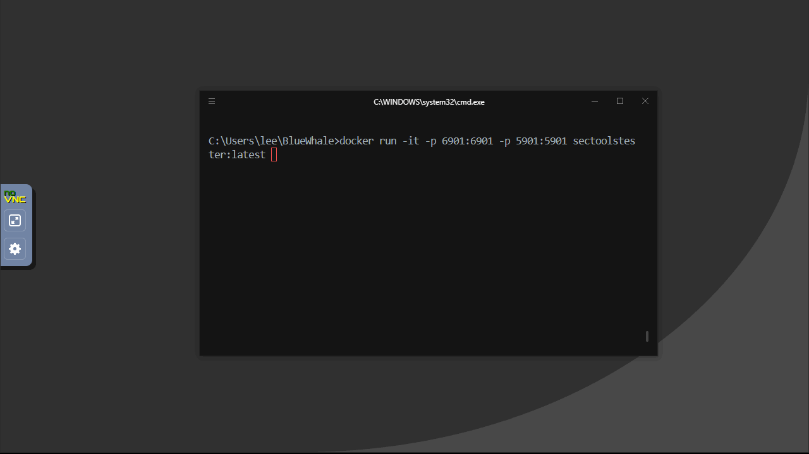
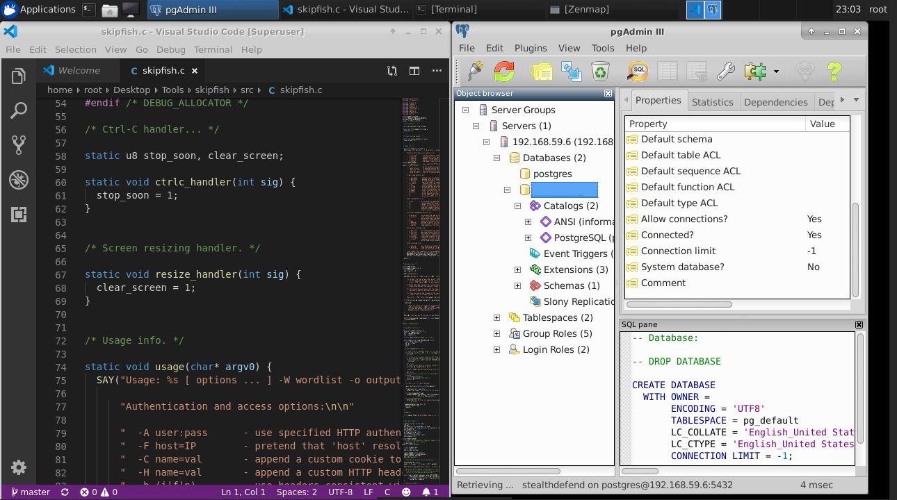
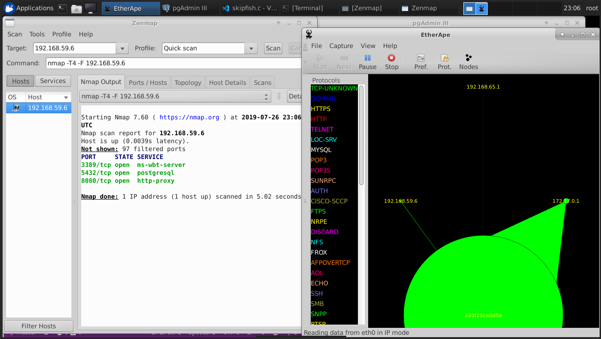
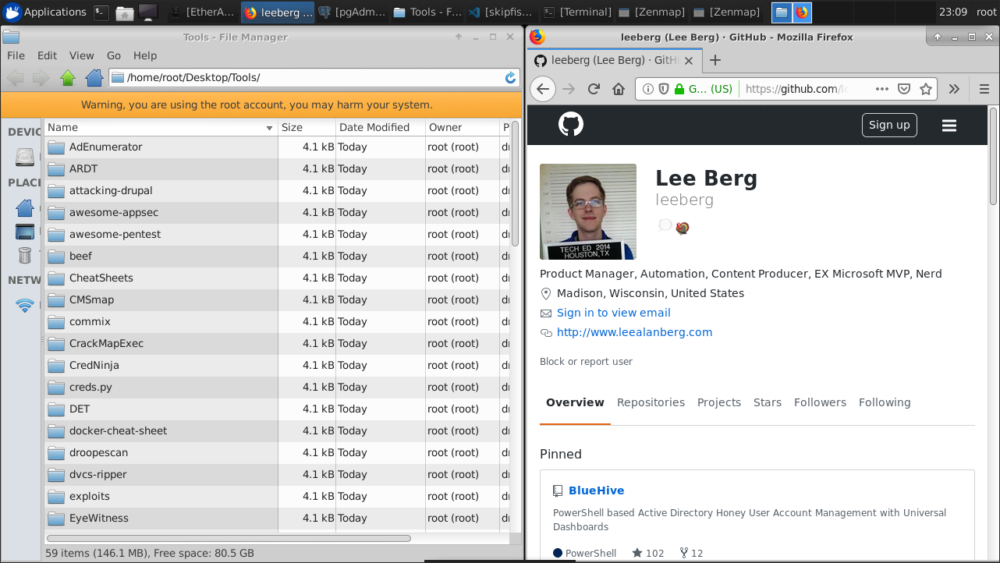

# BlueWhale
BlueWhale a MASSIVE Ubuntu Container with XFCE and NoNVC to provide a UI for general infosec tool testing.

It's a REALLY BAD IDEA, but i'm testing it out anyways. This dockerfile results in 3.5 GB Container. This is strictly a method used to experiment with Docker containers and easily try out new security tools. **DO NOT** run this in your production. Only run this is network isolated dev environment as this container runs everything as root and has very weak security, plus the vnc password is in the repository and this readme :)

Huge Thanks to: [accetto](https://github.com/accetto) and their project [ubuntu-vnc-xfce-firefox-plus](https://hub.docker.com/r/accetto/ubuntu-vnc-xfce-firefox-plus) - if you want to see a better implementation of this concept go check it out! I based parts of my dockerfile off that work. My version just has many Security, Database, and Developer Tools loaded on it!



Now I have a container "more traditional GUI operating system "preloaded with many tools ready to use, in my example I have included a suite of dev and database tools as well. This essentially gives you a full VM experience through a docker container - all from a single command line.

Here are a few more examples of items/use cases included in this particular container.

**DevTools**


**InfoSec Tools**


**Tons InfoSec Tools and Browsing**



## Usage

1. Build and Run the Container
    ``` bash
    git clone https://github.com/leeberg/BlueWhale.git
    cd BlueWhale
    docker build . -t sectoolstester
    docker run -it -p 6901:6901 sectoolstester:latest 
    ```
2. Browse to your browser hostname:6901
3. Use the Password "s3ct3st3r99" at the No VNC Prompt.
4. You're in!
