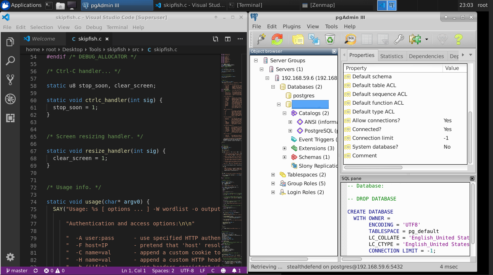
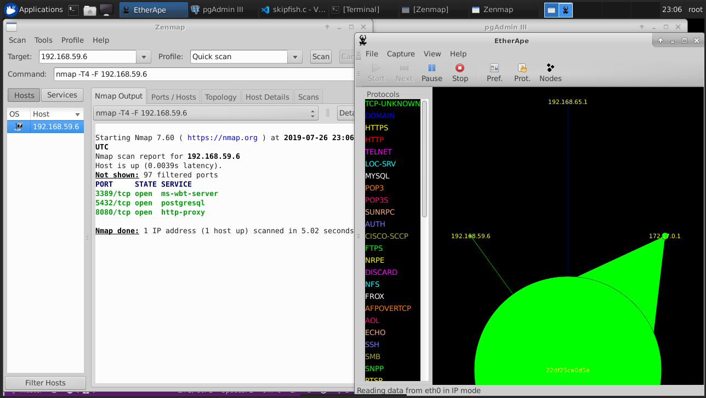

# the ways to test Security tools

Over the years when preseting at conferences, user groups, and to customers, I have often talked about learning resources to help learn tools and techinques in information security.

I have often been asked for some help or to expand on this topic.

These may include red team tools, blue team tools, and  such as metasploit and powershell empire.

* Using Windows SubSystem for Linux (WSL)
* Using Docker with Dockerized Applications
* Using the official [Kali](https://www.kali.org/) [Docker Container](https://hub.docker.com/r/kalilinux/kali-linux-docker)
* Tool Learning building a CUSTOM Docker with Ubuntu NOVNC XFCE

I feel that each of these methods represent slightly new /are slightly

Tool sets like KALI are amazing and typically the goto choice for leaning but I specifically wanted to use WSL and Docker in my experiments which is what I focused on them. 

I think this will be especially useful for those getting started in learning / exploring tooling

# Setting Up for Testimg

Our experiments as noted in this post generally require the following:

* Windows 10 - with Update May Update 1903
* Windows 10 Hyper-V Feature Installed
* Windows Sub System for Linux (Ideally V2 installed))

## Prepping your workstation

In order to faciliate my experiments, I am using the Windwos 10 with the 1903 

Windows 10, specifcally version [1903](https://docs.microsoft.com/en-us/windows/whats-new/whats-new-windows-10-version-1903) supports WSL 2.

I have the Hyper-v Role installed as it is needed for [Docker for Desktop]. [Docker for Desktop]([https://docs.docker.com/docker-for-windows/) allows use to run Windows and Linux containers on windows 10. 

This means I can quickly and easily author and create docker contains on my machine without having to go through the typical virtual machine management process. Look at any list of Pros/Cons for containerization and this will generally fit this post.


## Setting up Windows Subsystem for Linux
Windows Subsystem for Linux is a compatibility layer for running Linux binary executables natively on Windows 10 1607 and later. In interesting fact about WSL is that it isn’t based on virtual machines or containers. WSL provides a layer for mapping Windows kernel system calls to Linux kernel system calls. This allows Linux binaries to run in Windows unmodified. WSL also maps Windows services, like the filesystem and networking, as devices that Linux can access.

### A note about WSL 2
In May 2019, [WSL2](https://devblogs.microsoft.com/commandline/announcing-wsl-2/) was announced in preview. WSL 2 has all the same capabilities as WSL but has file system performance increases, and full system call compatibility. WSL 2 uses a real Linux kernel to run ELF64 Linux binaries on Windows.

Even though WSL2 is still in preview - I would **highly** recommend [installing and using WSL2](https://docs.microsoft.com/en-us/windows/wsl/wsl2-install)

You can then follow the [Windows Subsystem for Linux Installation Guide for Windows 10 Documention](https://docs.microsoft.com/en-us/windows/wsl/install-win10) to install a linux distro of your choice.


# Test Sec Tools with Windows SubSystem for Linux
Now that we have configured WSL2 on our workstation, we can immediatly start using it.

In my example I am using the Ubuntu distro. Kali is also a great choice as it will have many of the tools we all know and love pre-installed. But in my case I wanted a lighter expereince.

Starting up WSL is as simple as clicking a desktop icon, and immedialty we have our linux shell expereince.

One of the first thing I like to do is put a few essentials on my WSL instance. This includes GIT so I can clone github repositories, and a variey of frameworks like Pyhton and any text editors of choice (in my case [Nano](https://www.nano-editor.org/))

``sudo apt-get install -y python git nano``


# Tool Learning via Windows Subsystem for Linux (WSL)

One of my favorite attacks to test is Password Spraying. It's very simple to do and can be very effective, especially giving how easy it is to initiate these atacks. Let's Go end to end in our new WSL2 instance!

First we need some scripts! I suggest the password spraying script [spray](https://github.com/Greenwolf/Spray) by [Jacob Wilkin](https://github.com/Greenwolf) for its' ease of use and effectiveness.

First, we will clone the password spray directory and use the built in resources to iniate a password spray against a domain machine!

``git clone https://github.com/Greenwolf/Spray.git``


What's great about this example is now I have a tool running in a Linux instance on my Windows machine that I can call anytime in seconds. I enjoy using WSL on my desktop as in some cases it allows me to eliminate the need to jump to another virtual machine / ssh session as I can run my tools right from the linux kernel on my Windows 10 desktop.


# Tool Learning via Docker with Dockerized Applications

While we will be running Docker on WINDOWS we will be running linux containers. "Windows Containers" are an option but don't have the same level of popularity or support for Linux Containers especially given the progress of .NET CORE support forlinux.

In this example I will generating a lightweight container with Alpine Linux and NMAP. I will use a [dockerfile](https://docs.docker.com/engine/reference/builder) to define my base image and then add nmap. This will generate a container image that I can run anytime with apline linux and nmap setup and ready to go. The best part? This container is only 20MB, which allows me to start the container and use this tool nearly instantly.


First we define our dockerfile:

``` dockerfile
# Base from Lightweight Alpine Linux
FROM alpine:latest

# Install nmap
RUN apk add nmap --no-cache && rm -f /var/cache/apk/*
```

Now that we have container image defined, we can initiate a docker build command to generate our new container (in my example named: "nmaptest"), and finally we can run the container interactively to enter the container right in my commandline.

``` cmd
docker build . -t nmaptest

docker run -it nmaptest 

nmap -sn 127.0.0.1
```


This illustrates that we can use very lightweight container to test individual tools in a "One Container, One Tool" model. This is a good option for trying to learn a specific tool.


# Tool Learning via Docker with Kali Docker

Kali also has its own Docker Container! Yes you can run an instance
[Kali Linux Docker container](https://hub.docker.com/r/kalilinux/kali-linux-docker)


``` bash
# Download the Container Images
docker pull kalilinux/kali-linux-docker
```


Once the Kali Docker Container is downloaded - you can simply run the container and have command line access to a base kali instance. This provides a solid base instance for easy installation and testing of components from other [Kali Metapackages](https://tools.kali.org/kali-metapackages) because the Kali Docker Container has all the sources for Kali tool built in - this allows you to easily create Kali containers with your favorite tools.

Now that we have the offiical Kali Linux Docker container downloaded, let's run it in interactive mode, add [Sqlmap](https://github.com/sqlmapproject/sqlmap) the "Automatic SQL injection and database takeover tool" and try it out: 

``` bash
# Run the Container
docker run -it kalilinux/kali-linux-docker

# install SQL MAP
apt-get update && apt-get install -y sqlmap

sqlmap --wizard

```


Using this base docker container image, you could easily customize your own containers to run other kali compatible major tooling frameworks such as [Burpsuite](https://portswigger.net/burp) and[Metasploit.com](https://www.metasploit.com/) and smaller more laser focused tooling such as [BeEF](https://beefproject.com/), [Hydra](https://packages.debian.org/sid/net/hydra]), [The Backdoor Factory](https://tools.kali.org/exploitation-tools/backdoor-factory), and [sqlmap](http://sqlmap.org/)


This illustrates that we can use large container to test multiple tools and frameworks in a "One Container, Many Tools" model. This is an option for trying to learn broader set of tools.


# Tool Learning with highly experimental UI Enabled Docker containers

Now let's really do an experiment. If you really want to try something new 

In this example we will go far outside the traditional microservices use-case of docker, and we will be adding UI components to a container and remotely logging into a containerized ubutnu OS preloaded with some information security tools.

I have prepared a dockerfile that will complete the following steps
1. Create a new image based on the latest Ubuntu Container Image.
2. Add VNC & NOVnc for remote container access
3. Add the XFCE UI Components on the container
4. Install a wide variety of tools, frameworks, and security tools.
5. Initiate no VNC.

**DISCLAIMER**
This dockerfile results in 3.5 GB Container. This is NOT how you should build your containers. This is strictly a method used to experiment with Docker containers and easily try out new security tools. **DO NOT** run this in your production. Only run this is network isolated dev environments.


``` cmd
docker build . -t sectoolstester
docker run -it -p 6901:6901 -p 5901:5901 sectoolstester:latest

```

What this gives use is a container with a full UI experience preloaded with many tools ready to use, in my example I have included a suite of dev and database tools as well. This essentially gives you a full VM experience through a docker container - all from a single commandline.


**DevTools**


**InfoSec Tools**


**Tons InfoSec Tools and Browsing**


This illustrates an extreme use case whereases we we can use an extremely large container to test multiple tools and frameworks with a UI in a "One Container, Many Tools" model. This is an option for trying to learn learn broader set of tools and/or build a quick deployment lab instance of linux.
